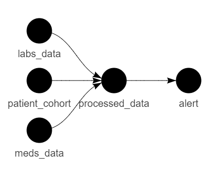
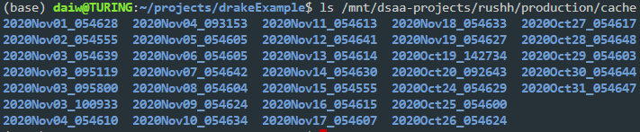

```{r setup, include=FALSE}
knitr::opts_chunk$set(echo = TRUE,
                      eval = F)
```

> For more details, please refer to the [official drake documentation.](https://books.ropensci.org/drake/)

# What is a pipeline?

Pipelines are just a series of steps, and chances are you've already created a pipeline in the past. `drake` is a package focused on creating robust R pipelines. While it is a huge package with lots of features, with a few tips, you should be able to integrate `drake` into your development and deployment workflow. The following demonstrates how you can do this, as well as why you might want to do this. All examples are available in [this accompanying Github repository](https://github.com/LKS-CHART/drakeExample).



The above image contains a simple pipeline. From here on out, we will refer to nodes in the pipeline diagram as "targets", ie. they are intermediate steps that are relevant for our specific pipeline. There are three initial targets: 1) `labs_data`, 2) `patient_cohort`, and 3) `meds_data`; none of these targets depend on anything else, as indicated by the lack of arrows feeding towards them. However, all three of them are required for creating the `processed_data` target, which then is required for the `alert` target. This is an example pipeline diagram that can be easily created with `drake`, and clearly shows the dependencies in your pipeline.

# How {drake} works - a very high-level perspective

There are two core components to every `drake` pipeline: the **plan**, and the **cache**. The developers specify their pipeline by creating a plan, which can then be executed; upon execution of a plan, `drake` stores data from that run in the cache. 

## The Plan

`drake` plans are simple to create using `drake::drake_plan()`:

```{r}

plan <- drake::drake_plan(
    # Get patient cohort
    patient_cohort = get_patient_cohort(),
    
    # Get labs data
    labs_data = get_labs_data(),
    
    # Get meds data
    meds_data = get_meds_data(),
    
    # Process all data
    processed_data = process_data(patient_cohort,
                                  labs_data,
                                  meds_data),
    
    # Send email alert
    alert = send_alert(processed_data = processed_data,
                       recipients = "david.dai@unityhealth.to")
)

```

In the above example, there are four targets, or "steps", in the plan. Each target is created with an associated function. In essence, to this forces the developer to breakdown the overall task (ie. the full pipeline) into smaller, more manageable steps, where each step can be completed via a function that can be independently developed and tested. 

To execute this plan, you simply need to call `drake::make(plan)`.

## The Cache

When you execute a `drake` plan, a bunch of data is created and stored in a cache. Importantly, *each target is cached and can be later retrieved*. This is a super cool way to store important data that you may want to access later on, and requires no extra work on the developer. For example, by executing your daily jobs using `drake`, you can create a cache folder for each day's job, and store that day's job's cache in its respective folder, like the following:



For data analysis pipelines, this is a handy way to archive your daily data for later use (eg. monitoring, evaluation, debugging). To specify a specific cache path location:

```{r}
cache_path <- "/some/path/to/the/cache"

drake::make(plan,
            cache = drake::drake_cache(path = cache_path))
```

Once your job has run, you can retrieve a specific cached target as follows:

```{r}
# Get patient_cohort from today's job
cache_path <- "path/to/todays/cache"

patient_cohort <- drake::readd(target = "patient_cohort",
                               cache = drake::drake_cache(path = cache_path))
```

# Development workflow

Here is an example workflow that you might use when developing a new pipeline.

1. Break down pipeline into logical steps. What is the end goal? What needs to happen first? How should you break down the steps between your start and end points? Each target should be meaningful, and it may be helpful to think about what are intermediate datasets/objects that you might want to access later on.

2. Once you have a good sense of the steps of the pipeline, you are ready to create the first function of your new project: your pipeline plan! When creating your plan, try to stick to the convention of using nouns for target names, and verbs for the functions that create the targets. For example:

```{r}
#' Create a drake pipeline to generate model predictions
#'
#' @export
#' @import drake
create_prediction_pipeline <- function() {
    drake::drake_plan(
        
        # Get patient cohort
        patient_cohort = get_patient_cohort(),
        
        # Get labs data
        labs_data = get_labs_data(),
        
        # Get meds data
        meds_data = get_meds_data(),
        
        # Process all data
        processed_data = process_data(patient_cohort,
                                      labs_data,
                                      meds_data),
        
        # Send email alert
        alert = send_alert(processed_data = processed_data,
                           recipients = "david.dai@unityhealth.to")
        
    )
}
```

3. After you have laid out plan, this provides a starting point for what you need to work on. At a minimum, you know will need to create five functions: `get_patient_cohort()`, `get_labs_data()`, `get_meds_data()`, `process_data()`, and `send_alert`. If these functions end up being too complex, you can also break down these functions into smaller utility functions (eg. `get_meds_data()` might call utilities `get_antibiotics_data()` and `get_insulin_data()`). Remember to write tests for these! [See here](https://github.com/LKS-CHART/threetips/blob/master/r_programming/mockery.md) for how to write unit tests for data analysis.

> Side note: developing `drake` pipelines in an R package structure is recommended, as `drake` pipelines are function-based and fits nicely in a package format. Just make sure to put all your functions in the `R/` folder. This also allows you to use the package development tools, including handy functions like `devtools::load_all()` and `devtools::test()`. 

4. Keep iterating until your pipeline is done! Chances are, you will be making changes to your original `drake` plan several times along the way, and that's totally fine. Don't stress about making things perfect - this just provides a framework for which to organize your work.

# Deploying `drake` pipelines

`drake` pipelines can be deployed and scheduled on RStudio Connect using RMarkdown documents. If you have developed your project in an R project structure, then your deployment is as simple as this:

```{r}
# Load all functions
devtools::load_all()

# Create pipeline
pipeline <- create_prediction_pipeline()

# Create cache for today's job
today <- format(Sys.Date(), "%Y_%m%d")
cache_path <- file.path("path/to/cache/root", 
                        today)
dir.create(cache_path)

# Run pipeline
drake::make(pipeline,
            cache_path = cache_path)
```

In fact, every single one of your future pipeline deployments will look almost identical to this :) Note: `devtools::load_all()` will only work if your deployment RMarkdown is in the root folder of your project, ie. at the same level as your `R/` folder and `DESCRIPTION` file. This will work if you only have one pipeline deployment, but if you have multiple deployments for your project, stay tuned for a follow-up session on a more general way on how to structure your repositories.

# `drake` development workflows + GitHub + collaboration

Since `drake` development is function-oriented, it's very easy to collaborate with other team members on the same project. If you are working on a new function that creates an intermediate target, you should create a new branch and submit a PR for code review. 
