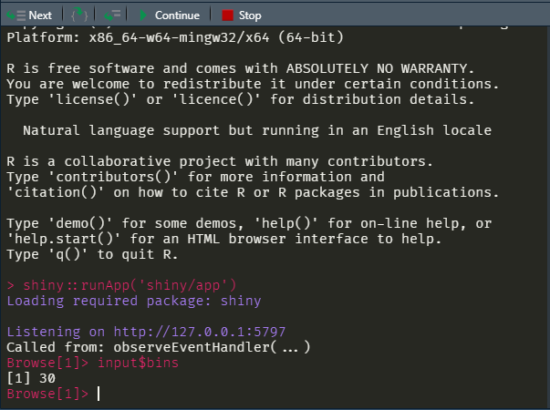

Debugging Shiny applications with `browser()`
================
September 03, 2020

# Debugging Shiny apps is hard

> Debugging Shiny applications can be challenging. Because Shiny is
> reactive, code execution isn’t as linear as you might be used to, and
> your application code runs behind a web server and the Shiny framework
> itself, which can make it harder to access.
> (<https://shiny.rstudio.com/articles/debugging.html>)

The above article provides an excellent summary of debugging
applications. I would suggest you read that article before reading
anything I write :). With that said, after a couple years of working
with Shiny (struggles included) and trying out several of these options,
the one that I use the most as of today is the `browser()` method (this
might change, so check back for updates\!).

# What is `browser()`?

As per the R documentation, `browser()` interrupts “the execution of an
expression and allow the inspection of the environment where browser was
called from”. Essentially, `browser()` can be inserted into the body of
any R function; when the code execution reaches a `browser()` call, it
interrupts the code execution and allows the user to have interactive
access into the R environment at that point. This is a helpful way to
interrogate the environment, especially for R users who are used to
interactive programming.

# How does `browser()` work in Shiny apps?

In general, `browser()` will mainly used for server-side Shiny app
debugging, meaning you will typically want to insert this somewhere in
your app’s `server()` function. Consider the following app:

``` r
library(shiny)

# Define UI for application that draws a histogram
ui <- fluidPage(
    
    # Application title
    titlePanel("Old Faithful Geyser Data"),
    
    # Sidebar with a slider input for number of bins 
    sidebarLayout(
        sidebarPanel(
            sliderInput("bins",
                        "Number of bins:",
                        min = 1,
                        max = 50,
                        value = 30),
            actionButton("confirm",
                         "Confirm plot")
        ),
        
        # Show a plot of the generated distribution
        mainPanel(
            plotOutput("distPlot")
        )
    )
)

# Define server logic required to draw a histogram
server <- function(input, output) {
    
    observeEvent(input$confirm, {
        output$distPlot <- renderPlot({
            # generate bins based on input$bins from ui.R
            x    <- faithful[, 2]
            bins <- seq(min(x), max(x), length.out = input$bins + 1)
            
            # draw the histogram with the specified number of bins
            hist(x, breaks = bins, col = 'darkgray', border = 'white')
        })
    })
}

# Run the application 
shinyApp(ui = ui, server = server)
```

If you wanted to interrogate the input values at the time of plot
render, you can add a `browser()` call to interrupt the code before plot
rendering:

``` r
...
    observeEvent(input$confirm, {
        # Add browser call to interrogate inputs at time of plot render
        browser()
        output$distPlot <- renderPlot({
...
```

This allows you to access the R environment interactively via the R
console:



… and that’s really all there is to it\! This also works inside modular
application designs as well as any utility functions that may be loaded
from an external file (eg. `golem_utils_server.R` in golem apps).
