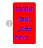

```{r setup, include=FALSE}
knitr::opts_chunk$set(echo = TRUE,
                      eval = FALSE)
```

Tooltips are small blurbs of text that appear over (or near) other UI elements when a user hovers their cursor.

Since they're hidden when not hovering, tooltips are a clean way to include help or instructions without cluttering an interface with too much text (although tooltips should be avoided when creating mobile-friendly interfaces).

For example, they're commonly applied to icons that don't take up too much space:


This tutorial demonstrates the [chartui](https://github.com/LKS-CHART/charui) tooltip utilities but feel free to explore [shinyBS](https://ebailey78.github.io/shinyBS/index.html) for tooltips too. 

Also note that interactive `chartui` examples can be viewed live in the [chartui dashboard](http://dsaa.unity.local/chartui/).

## Setup/installation

Install `chartui` from Github (note this `chartui` is available on Veneto too and can be used for things deployed to RSC).

``` {R}
# This is a private repo so GITHUB_PAT env var will need to be set, or provid auth_token=.... here.
devtools::install_github("LKS-CHART/chartui")
```

## Basic Usage

At the time of writing, chartui exposes the following tooltip utilities:

#### Default Icons
``` {R}
# an (i) icon
chartui::iconInfo(tooltip_text = "some text for more context", tooltip_position = "top")

# a (?) icon
chartui::iconHelp(tooltip_text = "some text to provide help", tooltip_position = "bottom") 

# a (!) icon
chartui::iconWarning(tooltip_text = "don't do this!", tooltip_position = "left")
chartui::iconWarning(tooltip_text = "definitely don't do this!", color = "red" tooltip_position = "left")

# a 'beaker' icon
chartui::iconExperimental(tooltip_text = "this feature is experimental", tooltip_position = "right") 
```

Its easy to add more default icons to `chartui` so please get in touch if there are more you would like added!


#### Custom Icons
``` {R}
# an icon I provide somewhere in inst/www/...
chartui::icon("www/icons/myownIcon.png", tooltip_text="the text that shows", tooltip_position = "top")
```

#### Anything I want to add a tooltip to
``` {R}
# Adding a tooltip to any ui element 
chartui::withTooltip(
    tooltip_text = "text that shows here...",
    tooltip_position = "right",
    content = tags$div(
        "anything can go in here...",
        tags$input(),
        plotOutput("mygraph")
    )
)
```

Full docs can are available with `?chartui`.


## How do these work?

These tooltip functions wrap the content provided (eg. the `icon` or whatever is passed to `content=...` in `withTooltip`) in a `<div>` tag, alongside another `<div>` which includes the tooltip text, and applies some CSS to ensure the tooltip is rendered when hovering and in the correct position.

For example, this R code:
``` {R}
chartui::iconInfo(tooltip_text = "tooltip text goes here...",tooltip_position = "right"),
```

Produces the following HTML:
``` {html}
<div class="chartui icon iconInfo">
    
    <div class="chartui-tooltip right">tooltip text goes here...</div>
</div>
```

and has the following relevant CSS rules applied:

``` {css}
/* by default icons are 14px */
.chartui.icon {
    position: relative;
    width: 14px;
    height: 14px;
}

/* stretch the img icon to be 100% of the container */
.chartui.icon > img {
    width: 100%;
    height: 100%;
    position: relative;
    vertical-align: top;
}

/* Default styling for the tooltip itself */
.chartui > .chartui-tooltip {
    position: absolute;
    background: rgb(120,120,120);
    padding: 3px;
    border-radius: 3px;
    color: white;
    text-align: center;
    opacity: 0;                         /* <- hidden when not hovered */
    transition: opacity 0.125s ease;
    pointer-events: none;
    z-index: 0;
}

/* when a sibling element (ie. the ) to the tooltip div id hovered, set opacity to 1 */
.chartui.icon > *:hover + .chartui-tooltip{
    opacity: 1;                        /* <- opacity set when hovered */
    z-index: 1;
}

/* position the tooltip to the right as specified in the R function call */
.chartui > .chartui-tooltip.right{
    top: 50%;
    left: 100%;
    transform: translate(2%,-50%);
}


```

## Customization With CSS

Tooltip styling can be customized by overriding css rules, for example:

``` {R}
tags$div(
    class = "my-css-class",
    chartui::iconInfo(tooltip_text = "tooltip text goes here...",tooltip_position = "right")
)
```

``` {css}
/* Just pre-pending the ".my-css-class" to the css selector: */
/* ".chartui > .chartui-tooltip" we can customize how the tooltip looks */
.my-css-class .chartui > .chartui-tooltip {
    background: red;
    color: blue;
}

```

Would produce this monstrosity:


## Customization using the `...` parameters to the R functions

Each the tooltip functions take any other arguments that can be passed to the `<div>` that wraps the tooltip and hover target.

For example:
``` {R}
chartui::iconInfo(tooltip_text = "tooltip text goes here...", id="custom-ID", style="width:100px; height:100px")
```

Would produce the following HTML, where the `id` and `style` arguments we passed have been applied to the parent `<div>`
``` {html}
<div class="chartui icon iconInfo" id="custom-ID" style="width:100px; height:100px">
    
    <div class="chartui-tooltip top">tooltip text goes here...</div>
</div>
```
