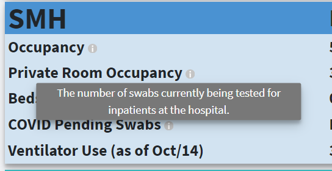

Tooltips in R Shiny Using chartui
================
Jamie Beverley
October 16, 2020

Tooltips are small blurbs of text that appear over (or near) other UI
elements when a user hovers their cursor.

Since they’re hidden when not hovering, tooltips are a clean way to
include help or instructions without cluttering an interface with too
much text (although tooltips should be avoided when creating
mobile-friendly interfaces).

For example, they’re commonly applied to icons that don’t take up too
much space:

This tutorial demonstrates the
[chartui](https://github.com/LKS-CHART/charui) tooltip utilities but
feel free to explore
[shinyBS](https://ebailey78.github.io/shinyBS/index.html) for tooltips
too.

Also note that interactive `chartui` examples can be viewed live in the
[chartui dashboard](http://172.29.165.21:3939/chartui/).

Setup/installation
------------------

Install `chartui` from Github (note this `chartui` is available on
Veneto too and can be used for things deployed to RSC).

    # This is a private repo so GITHUB_PAT env var will need to be set, or provid auth_token=.... here.
    devtools::install_github("LKS-CHART/chartui")

Basic Usage
-----------

At the time of writing, chartui exposes the following tooltip utilities:

#### Default Icons

    # an (i) icon
    chartui::iconInfo(tooltip_text = "some text for more context", tooltip_position = "top")

    # a (?) icon
    chartui::iconHelp(tooltip_text = "some text to provide help", tooltip_position = "bottom") 

    # a (!) icon
    chartui::iconWarning(tooltip_text = "don't do this!", tooltip_position = "left")
    chartui::iconWarning(tooltip_text = "definitely don't do this!", color = "red" tooltip_position = "left")

    # a 'beaker' icon
    chartui::iconExperimental(tooltip_text = "this feature is experimental", tooltip_position = "right") 

Its easy to add more default icons to `chartui` so please get in touch
if there are more you would like added!

#### Custom Icons

    # an icon I provide somewhere in inst/www/...
    chartui::icon("www/icons/myownIcon.png", tooltip_text="the text that shows", tooltip_position = "top")

#### Anything I want to add a tooltip to

    # Adding a tooltip to any ui element 
    chartui::withTooltip(
        tooltip_text = "text that shows here...",
        tooltip_position = "right",
        content = tags$div(
            "anything can go in here...",
            tags$input(),
            plotOutput("mygraph")
        )
    )

Full docs can are available with `?chartui`.

How do these work?
------------------

These tooltip functions wrap the content provided (eg. the `icon` or
whatever is passed to `content=...` in `withTooltip`) in a `
` tag,
alongside another `
` which includes the tooltip text, and applies
some CSS to ensure the tooltip is rendered when hovering and in the
correct position.

For example, this R code:

    chartui::iconInfo(tooltip_text = "tooltip text goes here...",tooltip_position = "right"),

Produces the following HTML:

    

        
        
tooltip text goes here...

    

and has the following relevant CSS rules applied:

    /* by default icons are 14px */
    .chartui.icon {
        position: relative;
        width: 14px;
        height: 14px;
    }

    /* stretch the img icon to be 100% of the container */
    .chartui.icon > img {
        width: 100%;
        height: 100%;
        position: relative;
        vertical-align: top;
    }

    /* Default styling for the tooltip itself */
    .chartui > .chartui-tooltip {
        position: absolute;
        background: rgb(120,120,120);
        padding: 3px;
        border-radius: 3px;
        color: white;
        text-align: center;
        opacity: 0;                         /* <- hidden when not hovered */
        transition: opacity 0.125s ease;
        pointer-events: none;
        z-index: 0;
    }

    /* when a sibling element (ie. the ) to the tooltip div id hovered, set opacity to 1 */
    .chartui.icon > *:hover + .chartui-tooltip{
        opacity: 1;                        /* <- opacity set when hovered */
        z-index: 1;
    }

    /* position the tooltip to the right as specified in the R function call */
    .chartui > .chartui-tooltip.right{
        top: 50%;
        left: 100%;
        transform: translate(2%,-50%);
    }

Customization With CSS
----------------------

Tooltip styling can be customized by overriding css rules, for example:

    tags$div(
        class = "my-css-class",
        chartui::iconInfo(tooltip_text = "tooltip text goes here...",tooltip_position = "right")
    )

    /* Just pre-pending the ".my-css-class" to the css selector: */
    /* ".chartui > .chartui-tooltip" we can customize how the tooltip looks */
    .my-css-class .chartui > .chartui-tooltip {
        background: red;
        color: blue;
    }

Would produce this monstrosity: 

Customization using the `...` parameters to the R functions
-----------------------------------------------------------

Each the tooltip functions take any other arguments that can be passed
to the `
` that wraps the tooltip and hover target.

For example:

    chartui::iconInfo(tooltip_text = "tooltip text goes here...", id="custom-ID", style="width:100px; height:100px")

Would produce the following HTML, where the `id` and `style` arguments
we passed have been applied to the parent `
`

    

        
        
tooltip text goes here...

    

