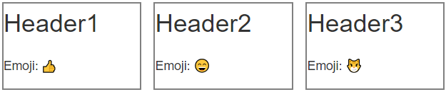
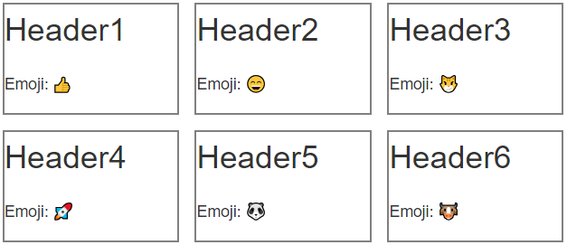

```{r setup, include=FALSE}
knitr::opts_chunk$set(echo = TRUE,
                      eval = FALSE)
```

Functional programming works hand-in-hand with modular app design frameworks like {golem} and Shiny modules. Defining functions to can be helpful to reduce code clutter for repetitive tasks, and can also be helpful for documentation and code review purposes. Functions can also be tested :).

# Why define custom UI functions?

Server side processing functions are regularly used for tasks like data processing. UI functions can also be very helpful, particularly in instances where you have repetitive UI elements. The following example demonstrates how you can define an `info_box()` UI function that can be invoked repeatedly to populate your app.

To facilitate the example, I've defined a few CSS rules. None of these are particularly important for this example; I am just leveraging CSS grid layout to help organize the repeated info boxes.

```{css}
/* CSS stylesheet */
    
/* Define a grid layout for organizing info boxes */
.grid {
    display: grid;
    grid-template-columns: repeat(3, 1fr);
    grid-gap: 1em;
}

/* A wrapper class for each info box */
.wrapper {
    border: solid 2px grey;
}

.header {
    font-size: 2rem;
}

.description {
    color: light-grey;
    font-size: 1rem;
}
```

Next, we define the `info_box()` function that will create our desired UI element. Since this is a function, we can also take advantage of function parameters to pass in data dynamically. 

```{r}
info_box <- function(header, description){
    htmltools::div(
        class = "wrapper",
        htmltools::div(
            class = "header",
            header
        ),
        htmltools::div(
            class = "description",
            description
        )
    )
}

```

Then we can call this function three times, and wrap it inside the previously defined CSS grid class to create a flexible, repetitive UI element.

```{r}
# Emojis
emojis <- c("+1", "smile", "smirk_cat", "rocket", "panda_face", "cow")

# ui.R
htmltools::div(
    class = "grid",
    info_box("Header1", glue::glue("Emoji: {emo::ji(emojis[1])}")),
    info_box("Header2", glue::glue("Emoji: {emo::ji(emojis[2])}")),
    info_box("Header3", glue::glue("Emoji: {emo::ji(emojis[3])}"))
)

```


(Note: I'm inserting screenshots here because CSS doesn't work on GitHub markdown :), but if you knit this using RMarkdown, it should look the same as the screenshots.)

For highly repetitive instances, we can even combine this with {purrr} to create an even more concise UI function.

```{r}
htmltools::div(
    class = "grid",
    purrr::map(1:6,
               ~ info_box(glue::glue("Header{.x}"),
                          glue::glue("Emoji: {emo::ji(emojis[.x])}")))
)
```



Compare this to what the code would look like without using functions!

```{r}
htmltools::div(
    class = "grid",
    htmltools::div(
        class = "wrapper",
        htmltools::div(class = "header",
                       "Header1"),
        htmltools::div(class = "description",
                       "Emoji: {emo::ji(emojis[1])}")
    ),
    htmltools::div(
        class = "wrapper",
        htmltools::div(class = "header",
                       "Header2"),
        htmltools::div(class = "description",
                       "Emoji: {emo::ji(emojis[2])}")
    ),
    htmltools::div(
        class = "wrapper",
        htmltools::div(class = "header",
                       "Header3"),
        htmltools::div(class = "description",
                       "Emoji: {emo::ji(emojis[3])}")
    ),
    htmltools::div(
        class = "wrapper",
        htmltools::div(class = "header",
                       "Header4"),
        htmltools::div(class = "description",
                       "Emoji: {emo::ji(emojis[4])}")
    ),
    htmltools::div(
        class = "wrapper",
        htmltools::div(class = "header",
                       "Header5"),
        htmltools::div(class = "description",
                       "Emoji: {emo::ji(emojis[5])}")
    ),
    htmltools::div(
        class = "wrapper",
        htmltools::div(class = "header",
                       "Header6"),
        htmltools::div(class = "description",
                       "Emoji: {emo::ji(emojis[6])}")
    )
)
```

