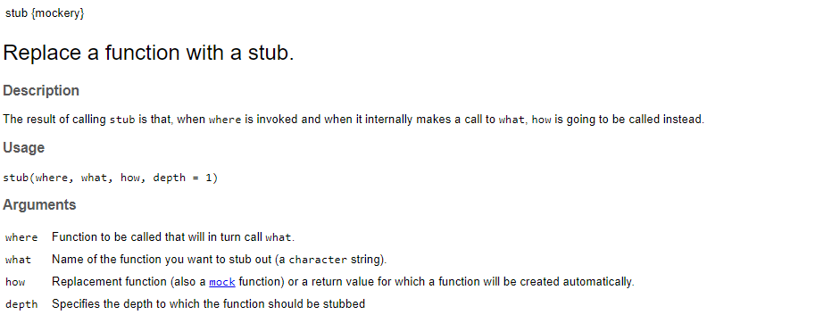

Using mocks in unit tests
================
October 15, 2020

# Use case example

  - You have a function that takes as input X and returns Y.

  - In this particular example, you have wrtten a function that
    retrieves “outcomes” (ICU transfer, palliative transfer, death) of a
    given list of encounter numbers. This function makes calls to
    different helper functions which rely on a connection to the EDW
    (`get_patient_adt` and `get_discharge_disposition`).

<!-- end list -->

``` r
#' get_outcome_events
#' @param con connection to the EDW
#' @param encounter_vector a list of encounter numbers
#'
#' @return a tibble with the following columns: ENCOUNTER_NUM, EVENT_TS, EVENT_TYPE
get_outcome_events <- function(con, encounter_vector) {
    
    # Retrieve patient Admit/Discharge/Transfer information
    # using the EDW connection
    adt <- chartwatch::get_patient_adt(con) %>%
        dplyr::filter(ENCOUNTER_NUM %in% encounter_vector)
    
    # Process adt and extract transfers to palliatives
    # units and to ICU units
    icu_transfers <- adt %>% 
        ...
    palliative_transfers <- adt %>%
        ...
    
    # Retrieve discharged encounters using the EDW
    # connection
    discharges <- chartwatch::get_discharge_disposition(con, encounter_vector)
    
    # Process discharged encounters to extract deaths
    gim_deaths <- discharges %>%
        ...
    
    # Merge everything together
    events <- rbind(
        icu_transfers,
        palliative_transfers,
        gim_deaths
    )
    return(events)
}

# TL;DR 
# connect to EDW
# pull location information
# pull discharge disposition
# process data and return: 
# dataframe of ICU transfers, palliative transfers, deaths
```

  - You test if the function works correctly… by running it through the
    console.


-----


  - What happens when you come back and look at this code 3 months
    later?

  

  - Instead of informally testing everything in the console, write a
    unit test\!

<!-- end list -->

``` r
# In R, create a test by running: usethis::use_test(...)

context("model_evaluation.R")

test_that("chartwatch::get_outcome_events() returns correct number of events", {
    
    # Add test code here!
    fake_encounter_nums <- c("1", "2", "3", "4", "5")
    con_edw <- ????? # What to do here???
    events <- chartwatch::get_outcome_events(con_edw, fake_encounter_nums)
    
})
```

  - This gets tricky because your function relies on other
    dependencies…. (In red, we have the parts that rely on external
    functions/EDW. In blue, we have the “main” logic of the code.)


**Solution**: Let’s use mocks and stubs.

# mockery and testthat

  - R libraries:
    
      - `mockery` is a mocking library for R.
      - `testthat` is a library for writing tests in R.

  - In our use case, we don’t want to actually connect to EDW each time
    and pull data. We only want to check that we’re correctly
    filtering/processing the outputs of helper functions
    `chartwatch::get_patient_adt` and
    `chartwatch::get_discharge_dispositions`. **The goal of this unit
    test is to test the behavior of the `chartwatch::get_outcome_events`
    function.**

  - From Martin Fowler’s [“Mocks Aren’t Stubs”
    article](https://martinfowler.com/articles/mocksArentStubs.html)

> **Stubs** provide canned answers to calls made during the test,
> usually not responding at all to anything outside what’s programmed in
> for the test.

> **Mocks** are \[…\] objects pre-programmed with expectations which
> form a specification of the calls they are expected to receive.

  - Back to our use case…. Let’s create some fake data
     

  - Then, let’s use `mockery::stub()` to override the behavior of
    `chartwatch::get_patient_adt` and
    `chartwatch::get_discharge_dispositions`



  - Putting it all together:

<!-- end list -->

``` r
context("model_evaluation.R")
require(mockery)

test_that("chartwatch::get_outcome_events() returns correct number of events", {

    # Load fake data
    load(system.file("testdata", "fake_adt_data.Rdata", package="chartwatch"))
    load(system.file("testdata", "fake_discharges_data.Rdata", package="chartwatch"))
    fake_encounter_nums <- c("1", "2", "3", "4", "5")
    # Fake data is set up so that:
    # Encounter 1 --> death
    # Encounter 5 --> ICU transfer

    # Instead of actually connecting to EDW, we're going to "mock" the connection
    con_edw <- mockery::mock()
    
    # Whenever these helper functions are called, replace the behavior
    stub(chartwatch::get_outcome_events, "chartwatch::get_patient_adt", fake_adt)
    stub(chartwatch::get_outcome_events, "chartwatch::get_discharge_disposition", fake_discharges)
    
    events <- chartwatch::get_outcome_events(con_edw, fake_encounter_nums)
    expect_equal(nrow(events), 2)
    expect_equal(events$EVENT_TYPE[events$ENCOUNTER_NUM == "1"], "Death")
    expect_equal(events$EVENT_TYPE[events$ENCOUNTER_NUM == "5"], "ICU")
    
    events <- chartwatch::get_outcome_events(con_edw, c("2", "3", "4"))
    expect_equal(nrow(events), 0)
})
```

# Miscellaneous / FAQ

## Why test?

[R packages: testing](https://r-pkgs.org/tests.html#test-tests)

> Code that’s easy to test is usually better designed. This is because
> writing tests forces you to break up complicated parts of your code
> into separate functions that can work in isolation.

## When to write unit tests?

[R packages: Writing tests](https://r-pkgs.org/tests.html#test-tests)

> Whenever you are tempted to type something into a print statement or a
> debugger expression, write it as a test instead. — Martin Fowler

## When to use mocks?

[StackOverflow answer to question “When should I
mock?”](https://stackoverflow.com/a/38256)

> A mock replaces that dependency. You set expectations on calls to the
> dependent object, set the exact return values it should give you to
> perform the test you want, and/or what exceptions to throw so that you
> can test your exception handling code. In this way you can test the
> unit in question easily. **TL;DR: Mock every dependency your unit test
> touches.**
